## Motivation

    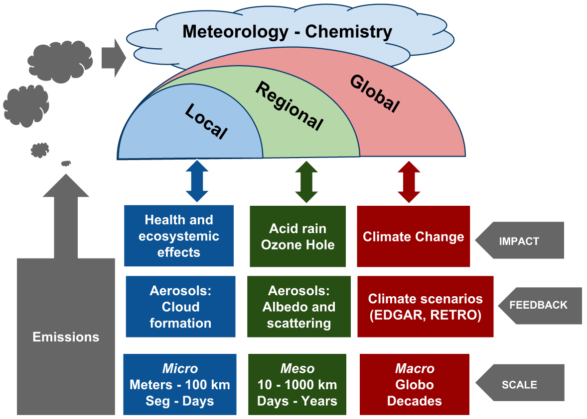

--- .class1 

## Motivation
### Vehicular emissions of MR POA
1. Teixeira (et al, 2008):  195,740 (tCO/y) in 2004
2. Ribeiro (et al, 2008):   160,015 (tCO/y) in 2004
3. Cuchiara (et al, 2009):  144,883 (tCO/y) in 2009

--- .class1

## Metropolitan Region of POA

    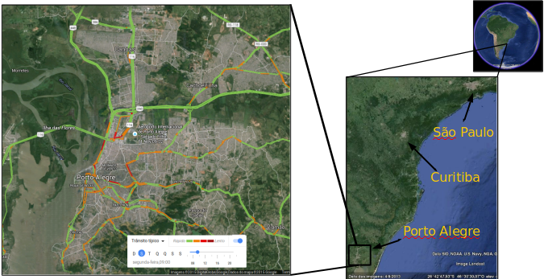

--- .class1

## Sources of emissions inventories

    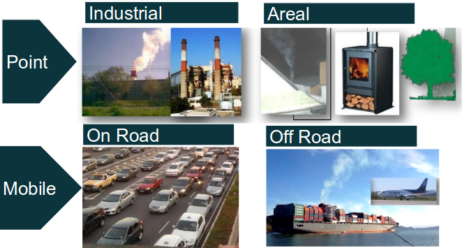

--- .class1 

## Objectives
1. To develop a bottom-up (by street,hour and day) vehicular emissions inventory for MR POA
2. Model emissions with WRF Chem

--- .class1 

## Material and methods
1. Road network from Open Street Map
2. remIAG_0.3.3
3. WRF Chem 3.6
4. NCEP FNL. 2012/6/6-2012/6/9
5. R 3.2.2 ggplot2, ggmap, maptools, ncdf,rgeos

--- .class1 

## Rede OSM

    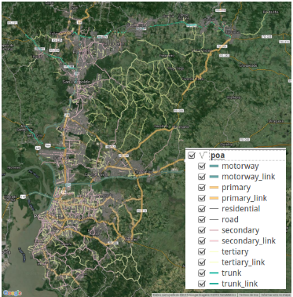

--- .class1 

## Method remIAG

    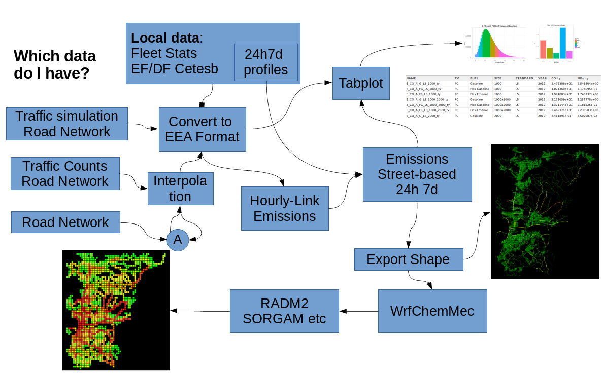

--- .class1 

## Model setup
- 2012-06-06 00:00 2012-06-09 00:00
- e_we =  60 * e_sn =  61
- ΔX = ΔY = 1000m
- 12 file emissions for monday

    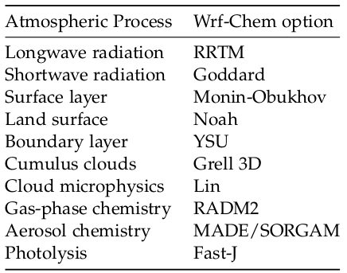

--- .class1 

## Synoptic conditions

    

--- .class1 

## Vehicle distributions

    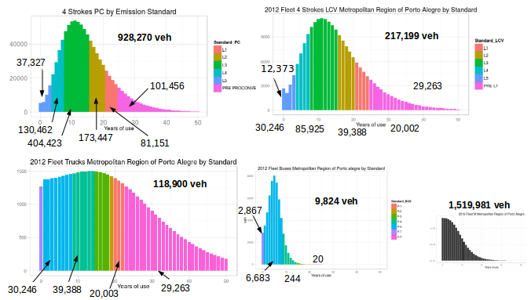

--- .class1 

## Emissions

    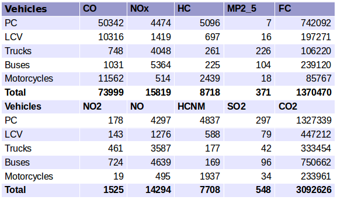

--- .class1 

## Emissions

    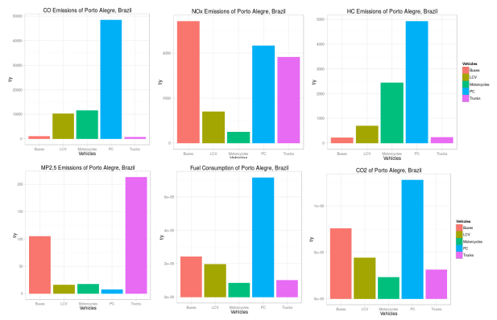

--- .class1 

## Emissions

    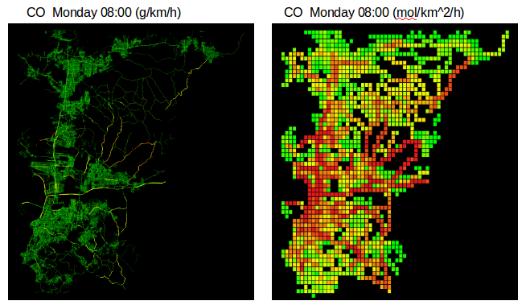

--- .class1 

## Emissions

    

--- .class1 

## Temperature and Wind

    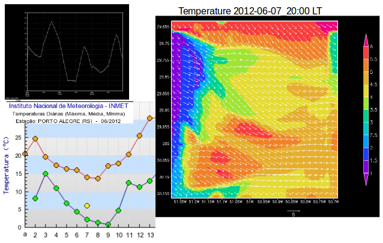

--- .class1 

## Concentrations

    

--- .class1 

## Concentrations

    

--- .class1 

## Concentrations

    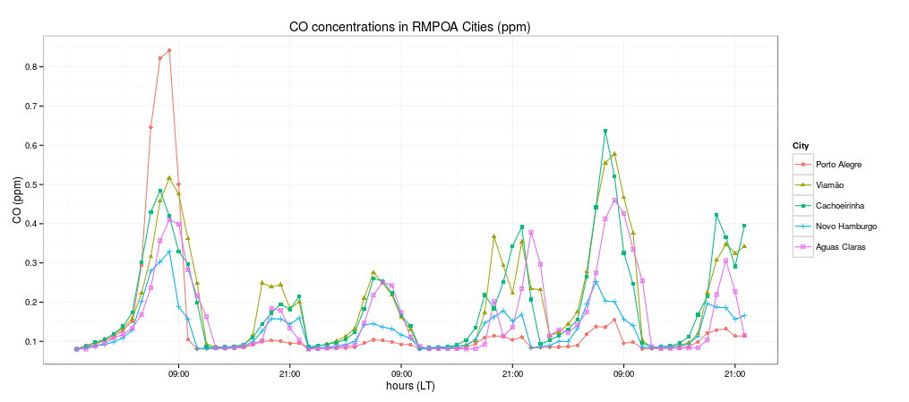

--- .class1 

## Discussion

    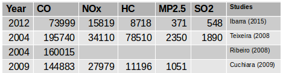

### Emissions looks smaller. Possible reasons:
1. Technological improvements (PROCONVE)
2. Different methods, DF, EF, etc
3. Average age of fleet and lack of traffic counts.
4. Higher number of motorcycles is an example of difficulty of this approach

### Air pollution simulation
1. Simulation 1x1 degree to 1x1 km give plausible results, but it needs nesting
2. Difficulty to get air pollution data

--- .class1 

## Application in Santiago

    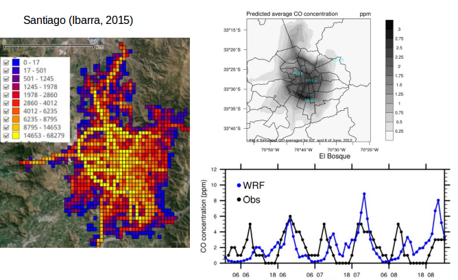

--- .class1 

## Application in Sao Paulo

    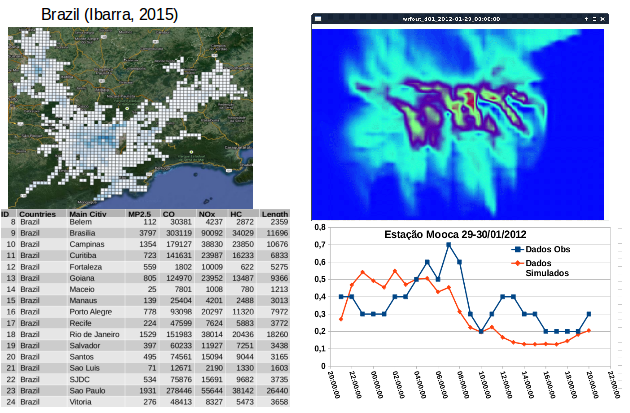

--- .class1 

## Conclusions
- remIAG gives plausivel results but need to be adapted to every city with available data, adjusting equation. 
- Emissions of POA follow an average city pattern.
- Results and model available in 2016 1x1 km.
- Southamerican results in raster and remIAG will be available in 2016.

--- .class1 

## References
- Cuchiara G., Rodrigues B., Costa-Carvalho J.  Modelagem da poluição fotoquímica na região metropolitana de porto alegre.  IV Encuentro Sul Meteorologia. 
- Teixeira E., Feltes S., Ramos de Santana E.  2008. Estudo das emissões de fontes móveis na região metropolitana de porto alegre, rio grande do sul. Quim. Nova, Vol. 31, No. 2, 244-248, 2008
- Ribeiro L., Arapujo P., Ramos de Santana E. e Costa-Carvalho J.  Estudo das emissões veiculares na região metropolitana de porto alegre. IV Jornada de Iniciação Científica - Meio Ambiente.  
- Ibarra S., Vara A., Ynoue R. 2015. Vehicular bottom-up emissions inventory and atmospheric simulation for 58 urban centers of South America. International conference on southern hemisphere meteorology and oceanography. Santiago, Chile, October  5-9.
- Boletim Sinotico CPETEC. http://tempo.cptec.inpe.br/bol_tecnico.shtml

--- .class1 

